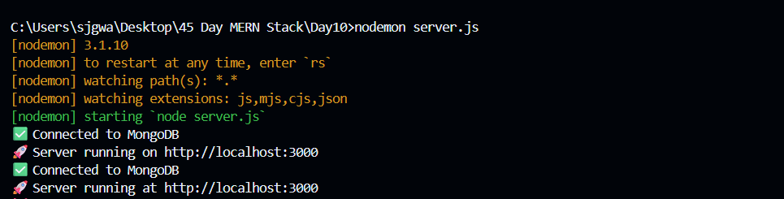
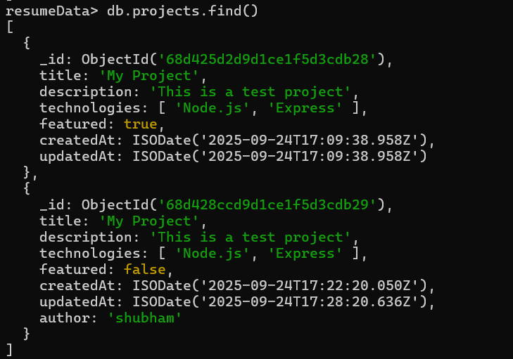
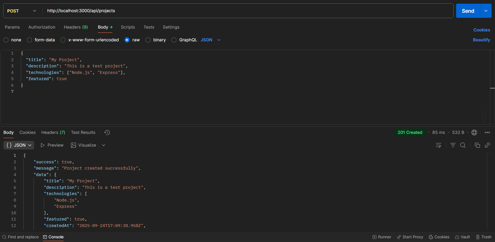
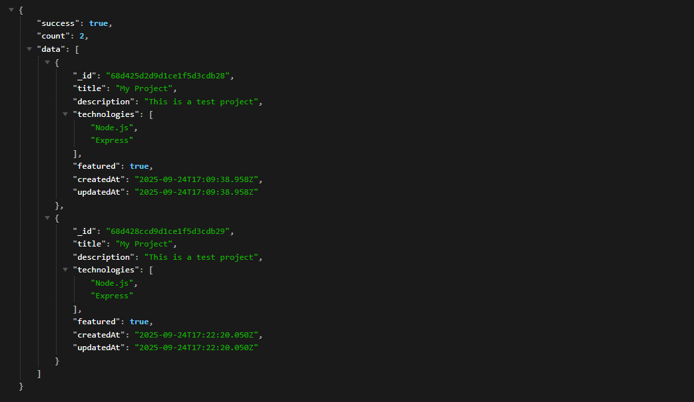
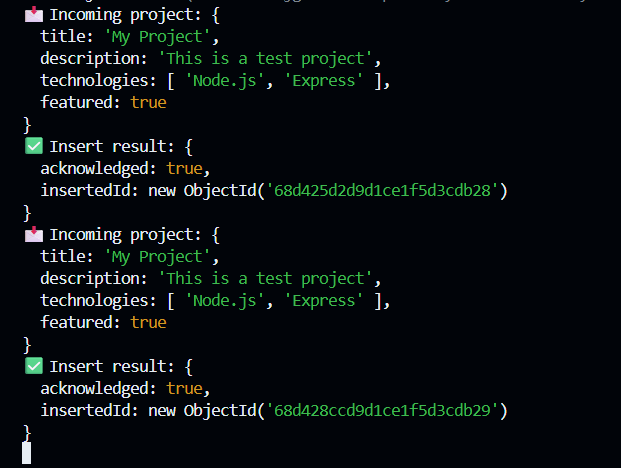

# Day 11 – Express + MongoDB (Create & Read API)

A **Node.js + Express + MongoDB** application that demonstrates **basic CRUD operations**.  
For this day, we implemented **Create (POST)** and **Read (GET)** for a `projects` collection.

---

## 📌 Project Overview
This project connects to a local **MongoDB** database (`resumeData`) and allows you to:

- **POST `/api/projects`** → Create a new project  
- **GET `/api/projects`** → Fetch all projects  
- **GET `/api/projects/:id`** → Fetch a specific project by its ID  

---

## 🎯 Requirements
- [Node.js](https://nodejs.org/) installed  
- [npm](https://www.npmjs.com/) (comes with Node.js)  
- [MongoDB](https://www.mongodb.com/try/download/community) 
running locally 
- [Postman](https://www.postman.com/downloads/) (for testing APIs) 

---

## 🚀 Preview

| Feature | Screenshot |
|---------|------------|
| Terminal Logs |  |
| MongoDB output data |  |
| POST `/api/projects` Response |  |
| GET `/api/projects` Response |  |
| Terminal Response for the operations|  |

---

## 🛠️ Steps to Run

1️⃣ **Install dependencies**

npm install express mongodb nodemon
