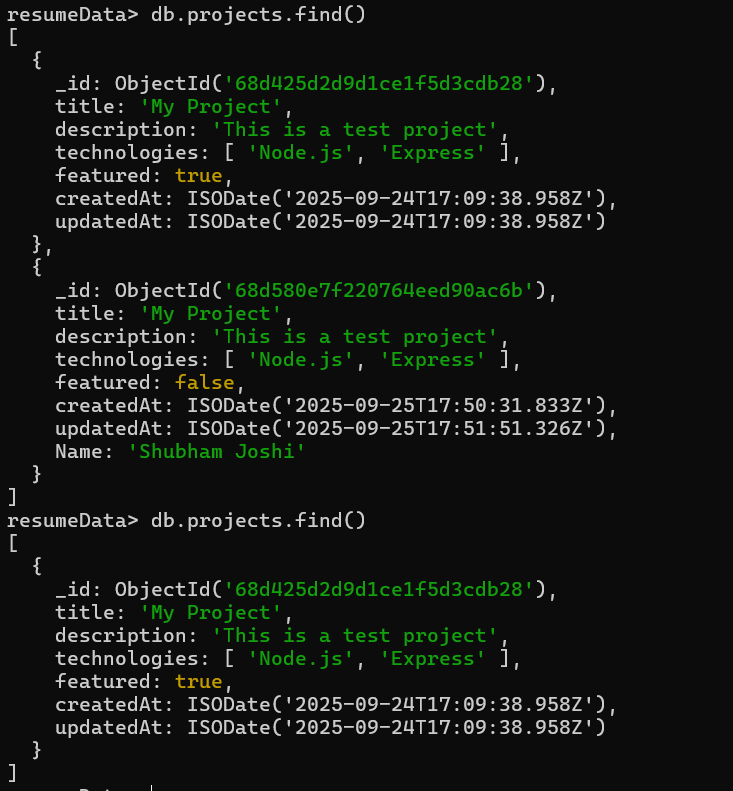
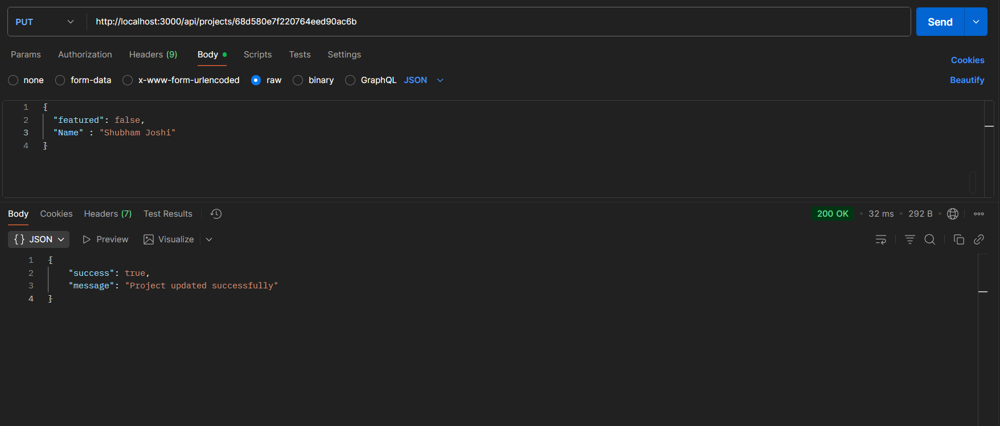
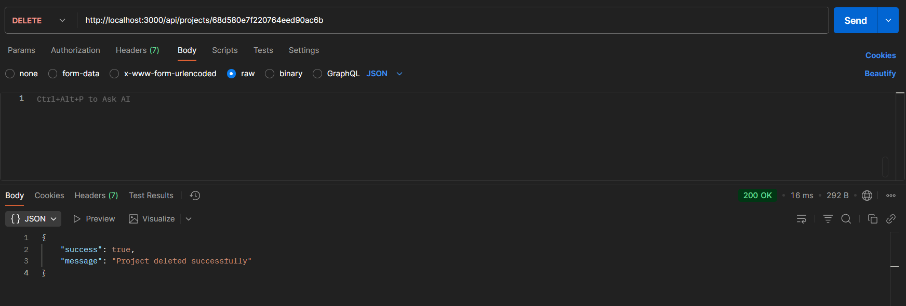

# Day 11 – Express + MongoDB (Update And Delete)

A **Node.js + Express + MongoDB** application demonstrating **CRUD (pdate, Delete) API** for a `projects` collection.

---

## 📌 Project Overview

This project connects to a local **MongoDB** database (`resumeData`) and provides the following endpoints:

- **PUT `/api/projects/:id`** → Update a project by ID  
- **DELETE `/api/projects/:id`** → Delete a project by ID  

---

## 🎯 Requirements

- [Node.js](https://nodejs.org/) installed  
- [npm](https://www.npmjs.com/)  
- [MongoDB](https://www.mongodb.com/try/download/community) running locally  
- [Postman](https://www.postman.com/downloads/) for testing APIs  

---

## 🚀 Preview

| Feature | Screenshot |
|---------|------------|
| MongoDB Compass |  |
| PUT `/api/projects/:id` |  |
| DELETE `/api/projects/:id` |  |

---

## 🛠️ Steps to Run

1️⃣ **Install dependencies**
npm install express mongodb
