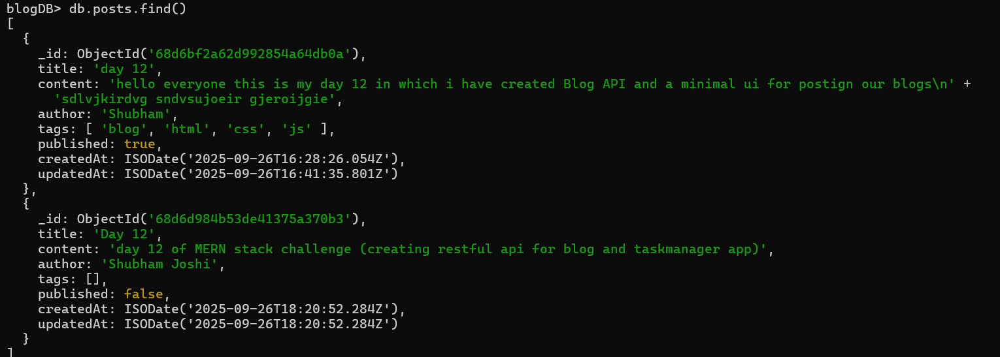
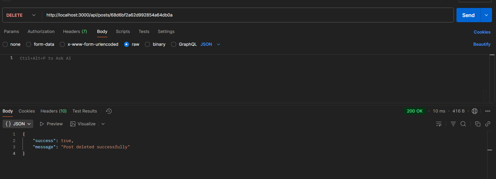
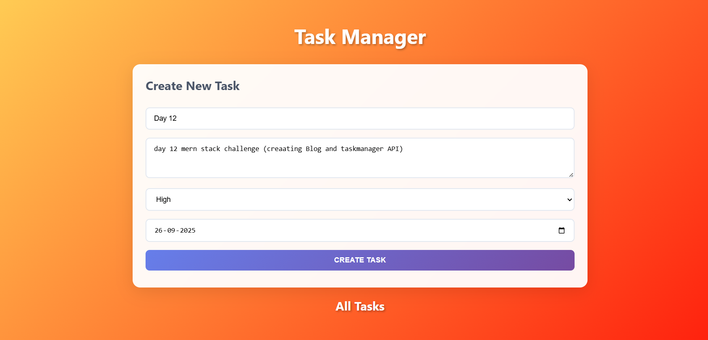
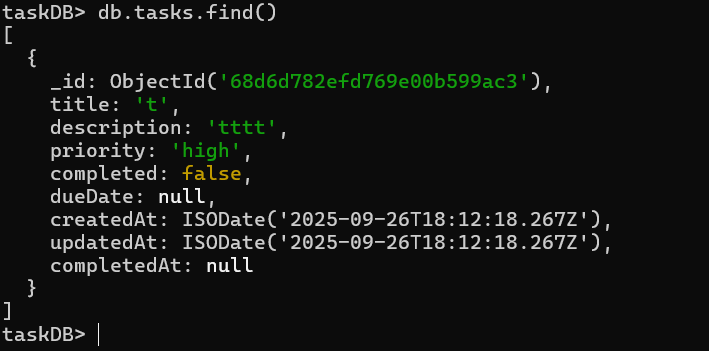
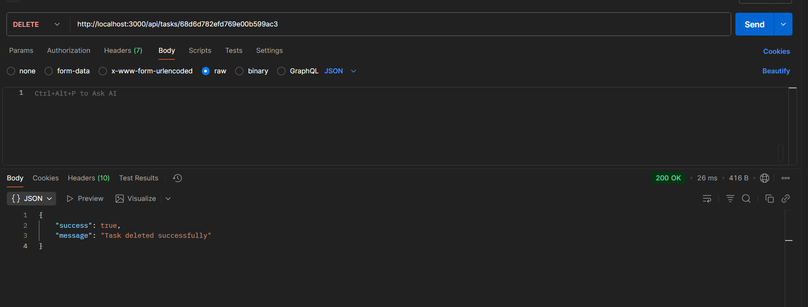

# Day 12 – API for blog app and taskmanager app

A **Node.js + Express + MongoDB** project that allows users to **create, view, update, and delete blog posts and tasks**.  

This day features **two projects** demonstrating **Node.js + Express + MongoDB** APIs along with simple **frontend interfaces**.

---

## 📌 Project Overview

## TASK 1 :- BLOG

1. **Backend (Express + MongoDB)**
   - **POST `/api/posts`** → Create a new post
   - **GET `/api/posts`** → Fetch all posts
   - **GET `/api/posts/:id`** → Fetch a specific post by ID
   - **PUT `/api/posts/:id`** → Update a post by ID
   - **DELETE `/api/posts/:id`** → Delete a post by ID
   - Handles validation, timestamps, and error responses.

2. **Frontend (HTML + CSS + JS)**
   - Form to create new blog posts
   - Display all posts dynamically
   - Shows timestamps for creation and updates
   - Responsive and styled UI with gradients, shadows, and hover effects

## TASK 2 :- TASKMANAGER

1. **Backend (Express + MongoDB)**  
   Provides a **RESTful API** to manage tasks:

   - **POST `/api/tasks`** → Create a new task
   - **GET `/api/tasks`** → Get all tasks with optional filters (completed, priority, dueDate), pagination, and sorting
   - **PUT `/api/tasks/:id`** → Update a task
   - **DELETE `/api/tasks/:id`** → Delete a task
   - **PUT `/api/tasks/:id/complete`** → Mark a task as complete
   - **GET `/api/tasks/stats`** → Get overall task stats (total, completed, pending, overdue, by priority, completion rate)

   **Features**:
   - Validates task title, priority, and due date
   - Auto-handles `createdAt`, `updatedAt`, and `completedAt` timestamps
   - Supports filtering, pagination, and sorting on GET requests

2. **Frontend (HTML + CSS + JS)**
   - Form to create new tasks
   - Display all tasks dynamically
   - Shows priority, status, creation, update, and due date
   - Styled with gradient backgrounds, badges for priority and completion
   - Responsive layout for desktop and mobile

---

## 🎯 Features

- Create, read, update, and delete posts (CRUD)
- Input validation for required fields (title, content, author)
- Dynamic display of all posts and tasks on the frontend
- Styled UI with responsive design
- Real-time updates when creating
- Handles empty or failed requests gracefully

---

## 🛠️ Requirements

- [Node.js](https://nodejs.org/)  
- [npm](https://www.npmjs.com/)  
- [MongoDB](https://www.mongodb.com/try/download/community) running locally  
- [Postman](https://www.postman.com/downloads/) for testing APIs  

---

## 🚀 Preview BLOG :-

| Feature | Screenshot |
|---------|------------|
| frontend POST and GET |  |
| MongoDB data |  |
| postman for PUT and DELETE |  |

---

## 🚀 Preview TASKMANAGER :-

| Feature | Screenshot |
|---------|------------|
| frontend POST and GET |  |
| MongoDB data |  |
| postman for PUT and DELETE |  |

---

---

## 🛠️ Steps to Run

1️⃣ **Install dependencies**

npm install express mongodb
