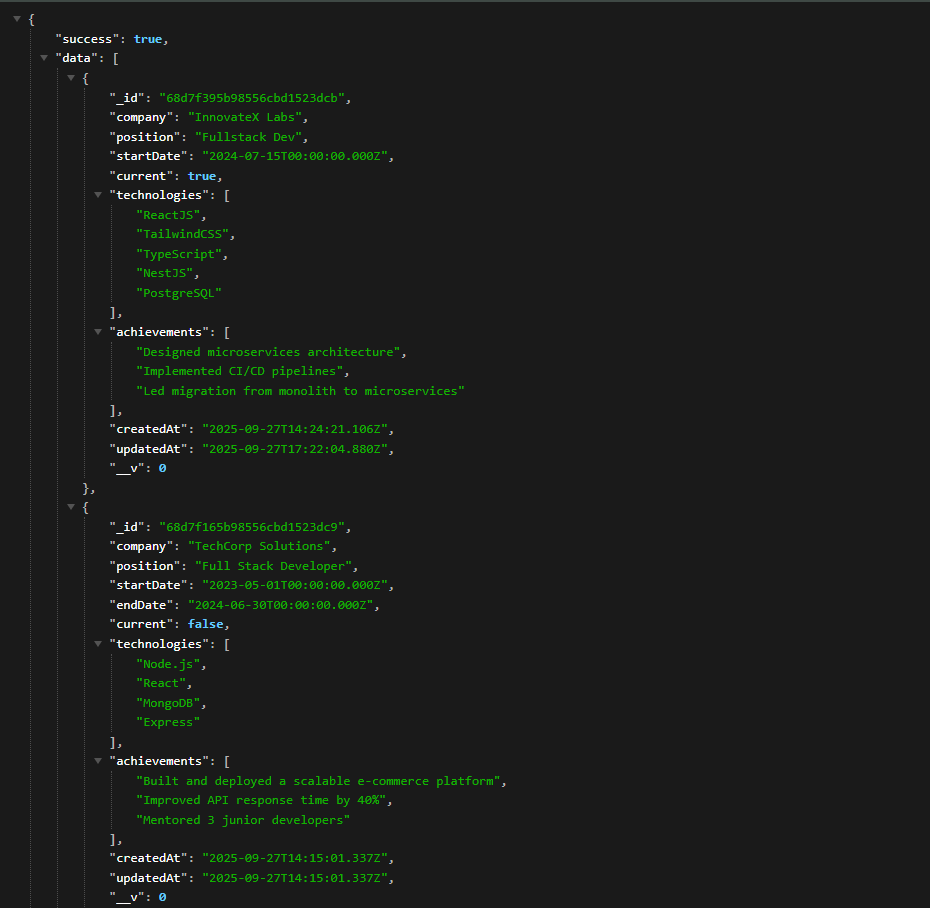
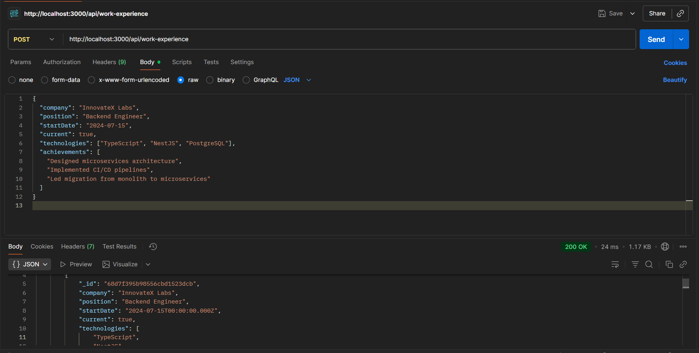
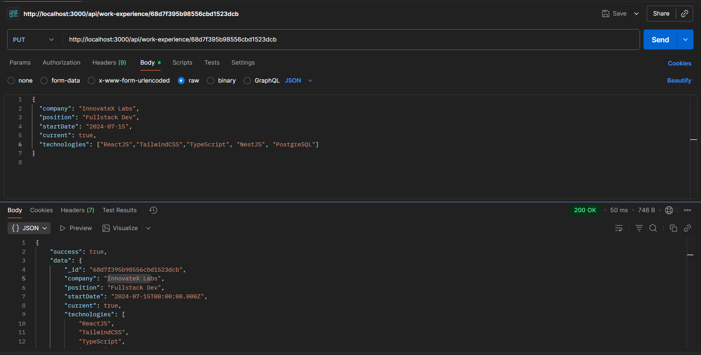
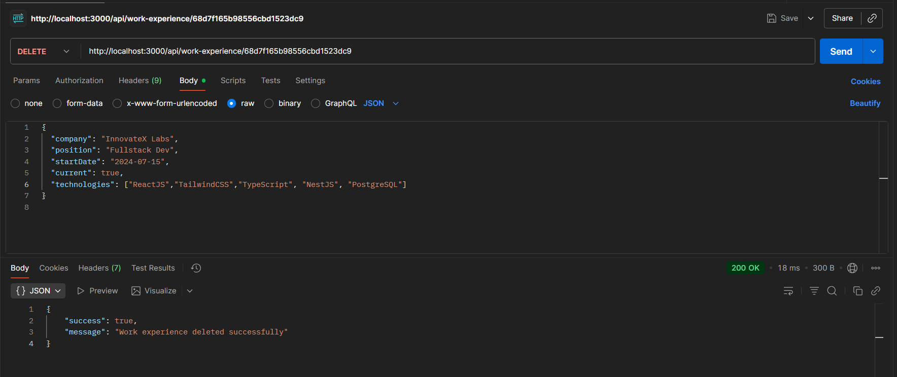
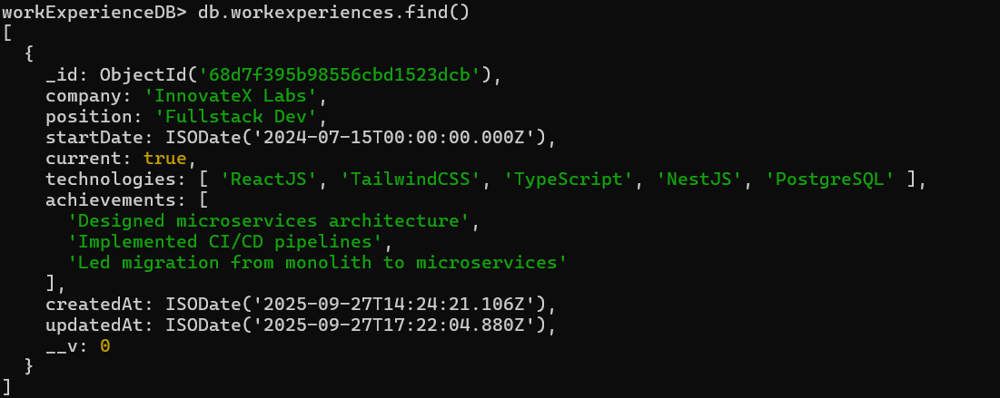

# Day 13 – Work Experience API

A **Node.js + Express + MongoDB** project that allows users to **create, view, update, and delete work experience records**.

This project demonstrates **real-world API design**, including **data modeling, validation, filtering, pagination, and error handling**.

---

## 📌 Project Overview

### Backend (Express + MongoDB)

1. **Work Experience API**

   * **POST `/api/work-experience`** → Create a new work experience entry
   * **GET `/api/work-experience`** → Fetch all work experiences (with filters, pagination, and sorting)
   * **GET `/api/work-experience/:id`** → Fetch a specific work experience by ID
   * **PUT `/api/work-experience/:id`** → Update an existing work experience
   * **DELETE `/api/work-experience/:id`** → Delete a work experience

   **Features** :

   * Input validation (company, position, dates)
   * Validation to ensure `endDate` is after `startDate`
   * Support for `technologies` and `achievements` arrays
   * Advanced query filtering:

     * `?current=true` → filter by current jobs
     * `?company=Tech` → search by company name
     * `?technology=React,Node.js` → filter by technologies
   * Pagination & sorting (`?page=1&limit=5&sort=-startDate`)
   * Auto-handles `createdAt` and `updatedAt` timestamps

2. **Error Handling**

   * Validation errors with detailed messages
   * Duplicate entry prevention
   * Invalid ID handling
   * Global error middleware for consistent responses

---

## 🎯 Features

* Full CRUD operations for work experience management
* Input validation & sanitization
* Query filtering, search, and pagination
* User-friendly error messages

---

## 🛠️ Requirements

* [Node.js](https://nodejs.org/)
* [npm](https://www.npmjs.com/)
* [MongoDB](https://www.mongodb.com/try/download/community) running locally
* [Mongoose](https://mongoosejs.com/) (for MongoDB object modeling)
* [Postman](https://www.postman.com/downloads/) for API testing

---

## 🚀 Example Requests

### Create a Work Experience

**POST** `/api/work-experience`

```json
{
  "company": "Tech Corp",
  "position": "Senior Developer",
  "startDate": "2023-01-15",
  "current": true,
  "technologies": ["React", "Node.js"],
  "achievements": ["Led team of 5 engineers"]
}
```

### Get All Work Experiences

**GET** `/api/work-experience?current=true&technology=Node.js&page=1&limit=5`

---

## 🛠️ Steps to Run

1️⃣ **Install dependencies**

```bash
npm install express mongodb nodemon
```

2️⃣ **Start MongoDB locally**

3️⃣ **Run the server**

```bash
node server.js
```

4️⃣ **Test API** in Postman or u can create UI for it

---

## 🚀 Preview

| Feature               | Screenshot              |
| --------------------- | ------------------------|
| Browser GET request   |          |
| Postman POST          |        |
| Postman PUT           |          |
| Postman DELETE        |    |
| MongoDB Data          |  |

---
