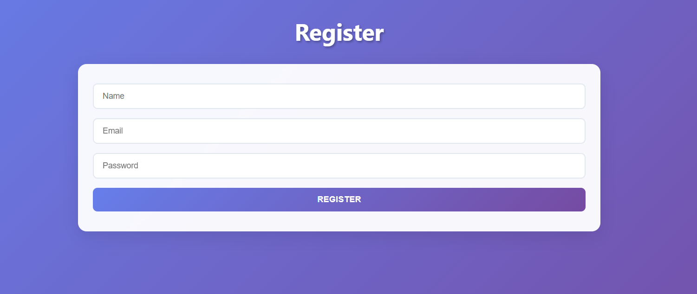
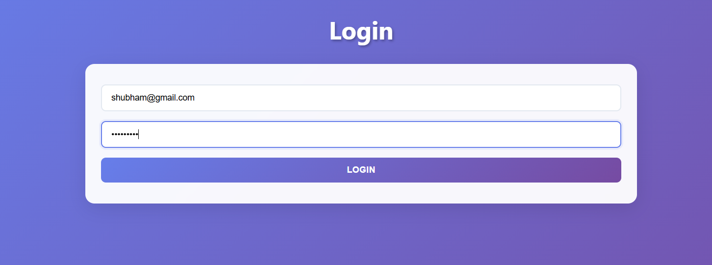
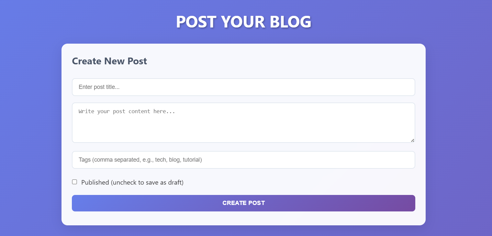
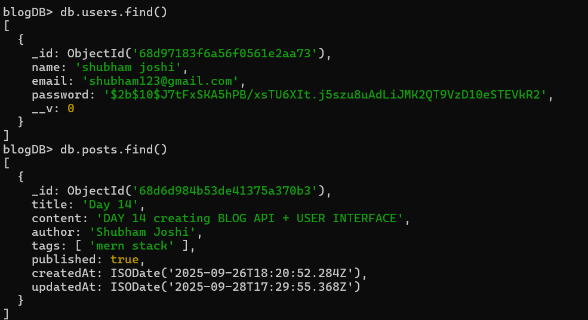

# Day 14 – Blog Platform with Authentication

A **Node.js + Express + MongoDB** project that allows users to **register, login, create, edit, and delete blog posts**, with full **authentication, content management**.

---

## 📝 Note on Development

During this challenge, I did not implement everything entirely on my own. I took help from ChatGPT multiple times whenever I faced errors, and I also used AI assistance to quickly create the frontend pages.

---

## 📌 Project Overview

### Backend (Express + MongoDB)

1. **Authentication API**

   * **POST `/api/auth/register`** → User registration
   * **POST `/api/auth/login`** → User login
   * **POST `/api/auth/logout`** → User logout
   * **POST `/api/auth/refresh`** → Refresh JWT token
   * **GET `/api/auth/me`** → Get current logged-in user

   **Features**:

   * Password hashing with `bcrypt`
   * JWT token-based authentication
   * Input validation & sanitization
   * Optiomal email verification

2. **Blog Posts API**

   * **GET `/api/posts`** → Fetch all posts
   * **POST `/api/posts`** → Create a new post
   * **GET `/api/posts/:id`** → Fetch a specific post
   * **PUT `/api/posts/:id`** → Update a post
   * **DELETE `/api/posts/:id`** → Delete a post

   **Features**:

   * Post fields: `title`, `content`, `author`, `tags`, `published`
   * Status: `draft` or `published`
   * Automatic `createdAt` and `updatedAt` timestamps
   * Input validation for required fields

3. **Comments API** ```Comments are NOT IMPLEMENTED yet```

   * **GET `/api/posts/:id/comments`** → Get post comments
   * **POST `/api/posts/:id/comments`** → Add comment
   * **DELETE `/api/comments/:id`** → Delete comment

4. **Error Handling**

   * Validation errors with descriptive messages
   * Authentication and authorization errors
   * Global error middleware for consistent API responses

---

## 🎯 Features

* User registration, login, and logout
* Full CRUD for blog posts
* Input validation & sanitization
* Responsive UI for desktop and mobile

---

## 🛠️ Requirements

* [Node.js](https://nodejs.org/)
* [npm](https://www.npmjs.com/)
* [MongoDB](https://www.mongodb.com/try/download/community) running locally
* [Mongoose](https://mongoosejs.com/) for MongoDB object modeling
* [Postman](https://www.postman.com/downloads/) for API testing
* Optional: modern browser to test frontend pages (`index.html`, `login.html`, `register.html`, `dashboard.html`)

---

## 🚀 Example Requests

### Register a User

**POST** `/api/auth/register`

---

## 🚀 Preview

| Feature               | Screenshot                            |
| --------------------- | --------------------------------------|
| REGISTER              |      |
| LOGIN                 |            |
| DASHBOARD             |    |
| GET PUT DELETE        |  |
| MongoDB Data          |        |

---
