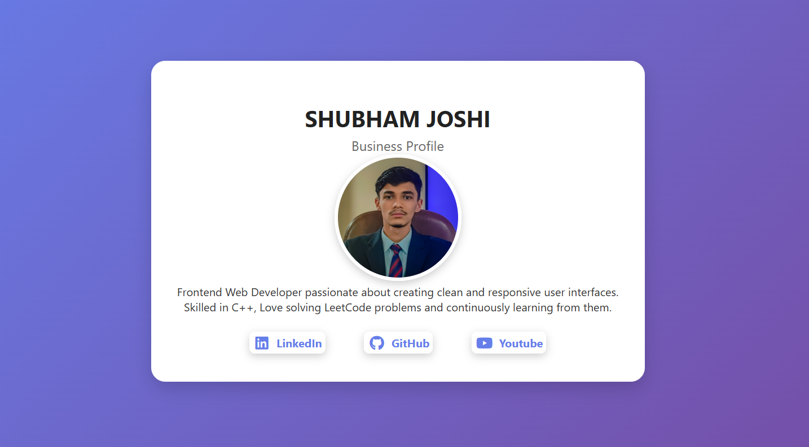

# Day 1 - My Business Card

A simple **HTML & CSS project** that represents my digital business card.  
It showcases my name, profile photo, short bio, and links to my social profiles with icons.

## ✨ Features 
- Profile photo with hover animation  
- Short bio / description  
- Social media links (LinkedIn, GitHub, Youtube) with icons  
- Smooth hover effects on the links  

## 🛠️ Technologies Used
- **HTML5**  
- **CSS3** (custom styles & gradients)  
- [Font Awesome](https://fontawesome.com/) for social media icons  

## 📸 Preview

## 🚀 How to Run
1. Clone this repository  

   git clone https://github.com/your-username/your-repo.git

