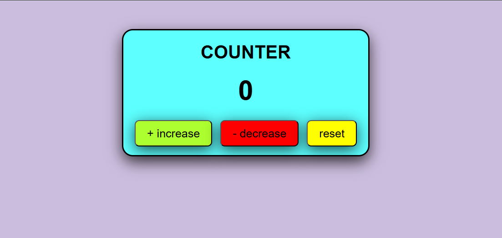
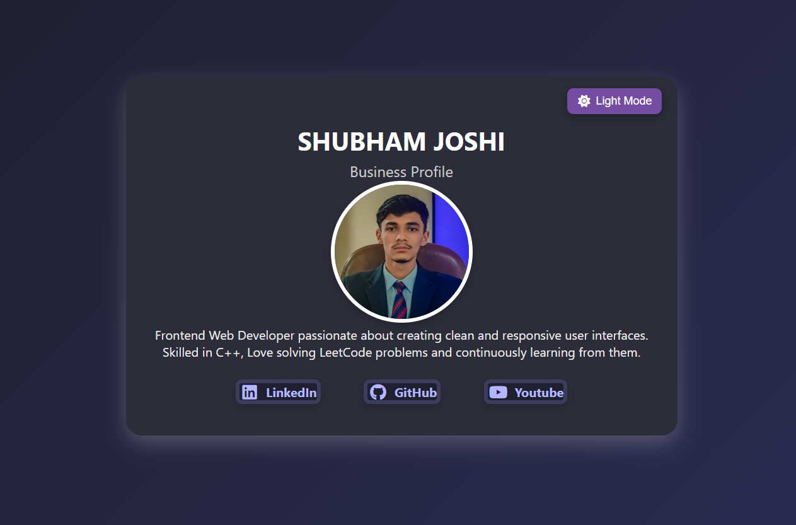

# Day 5 – click counter and darkmode

This repository contains **two simple HTML/CSS/JavaScript projects**:

1. A **Click Counter** – a fun counter app with increase, decrease, and reset buttons.  
2. An **Interactive Business Card** – a personal profile card with social links and a Dark/Light mode toggle.

---

## 📌 Projects Overview

### 1️⃣ Click Counter
A colorful, click-based counter where you can increase, decrease, or reset the value.

**Features**
- Clean and playful design  
- Buttons for **Increase**, **Decrease**, and **Reset**  
- Text color changes depending on value (green, red, or black)  

**Technologies Used**
- HTML5  
- CSS3 (inline styles inside `<style>` tag)  
- JavaScript for the counter logic

---

### 2️⃣ Business Card with Dark Mode
A modern digital business card with your name, profile, and links.  
Includes a toggle button to switch between **Dark Mode** and **Light Mode**.

**Features**
- Attractive profile card design with gradient background  
- Profile photo and short bio  
- Links to LinkedIn, GitHub, and YouTube  
- Dark/Light mode switch with animated icon  
- Hover effects on links and image  

**Technologies Used**
- HTML5  
- CSS3 (gradients, shadows, hover effects)  
- JavaScript (theme toggle)  
- Font Awesome for icons

---

## 🚀 Preview
| Project | Screenshot |
|---------|------------|
| Click Counter |  |
| Business Card |  |

---

## 🛠️ How to Run
1. Clone this repository:
   git clone https://github.com/your-username/your-repo.git