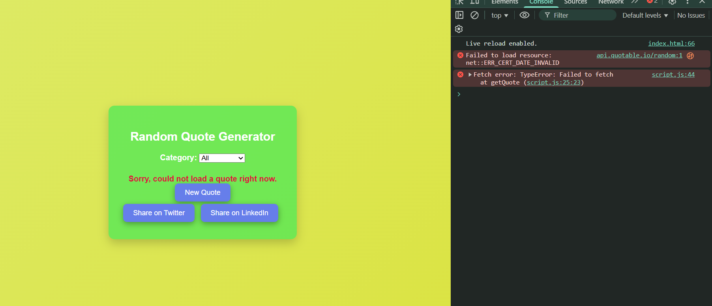
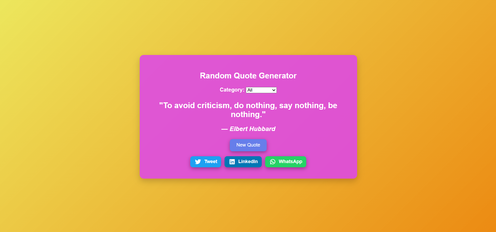
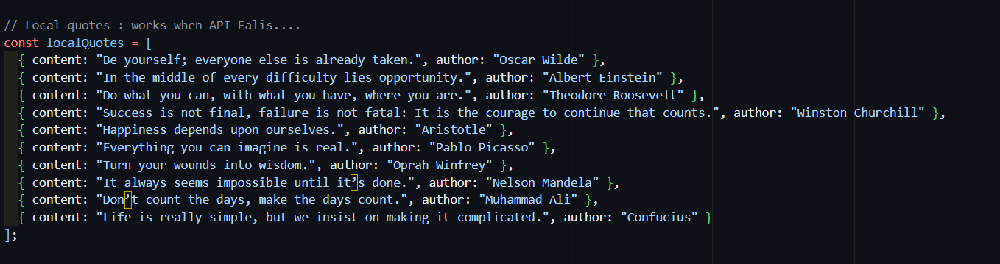

# Day 6 – Random Quote Generator

This repository contains a **Random Quote Generator** built with HTML, CSS, and JavaScript. The app fetches quotes from an API and provides fallback quotes when the API is unavailable.  

---

## 📌 Project Overview

### Random Quote Generator
A dynamic app that displays quotes from different categories, with options to share them on social media.

**Features**
- Fetches random quotes from the [Quotable API](https://api.quotable.io/)
- Local fallback quotes in case the API fails  
- Category selection: Wisdom, Friendship, Inspirational, or All  
- Social media sharing: Twitter, LinkedIn, WhatsApp  
- Loader animation while fetching quotes  
- Clean, colorful, and responsive design  

**Technologies Used**
- HTML5  
- CSS3 (flex, gradients, shadows, hover effects)  
- JavaScript (async/await, fetch API, DOM manipulation)  
- Font Awesome for social media icons  

---

## 🚀 Preview

| Feature | Screenshot |
|---------|------------|
| API Fallback Mode |  |
| Final Quote Generator |  |
| Since at starting the API keeps failing to fetch the quotes so i add a local quotes |  |

---

## 🛠️ How to Run
1. Clone this repository:  
git clone https://github.com/your-username/your-repo.git
