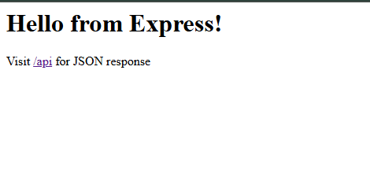
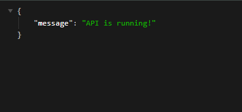

# Day 7 – Simple Express Server

A minimal **Node.js + Express** application that serves HTML at the root route (`/`) and a JSON response at `/api`.

---

## 📌 Project Overview
This project demonstrates how to set up a basic server using [Express](https://expressjs.com/).  
It listens on **port 3000** and provides two routes:

- `/` → Returns an HTML welcome page  
- `/api` → Returns a JSON message

---

## 🎯 Requirements
- [Node.js](https://nodejs.org/) installed on your machine  
- [npm](https://www.npmjs.com/) (comes with Node.js)  

---

## 🚀 Preview

| Feature | Screenshot |
|---------|------------|
| Hello form Express Page |  |
| "/api" json msg|  |

---

## 🛠️ Steps to Run

1️⃣ **Initialize the project**

npm init -y
