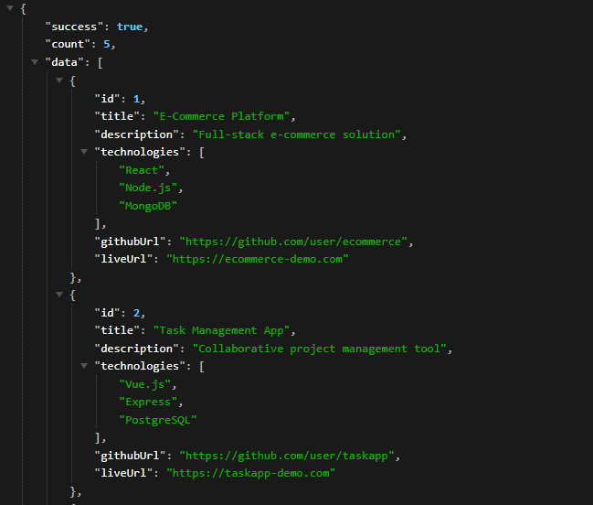

# Day 8 – RESTful Resume API

A simple **Node.js + Express** API that serves resume data (projects & work experience) using proper RESTful routing patterns.

---

## 📌 Project Overview
This project demonstrates how to build RESTful endpoints for resume data:
- **Projects** (with technologies)
- **Work Experience**

It includes support for:
- Listing all projects or experiences  
- Fetching a single project by its `id`  
- Handling 404 errors for unknown resources

---
## 🚀 Preview

| Feature | Screenshot |
|---------|------------|
| browser page |  |
| "/api/projects" page|  |

---

## 📂 Features
- GET all projects (`/api/projects`)  
- GET work experience (`/api/experience`)  
- GET single project by ID (`/api/projects/:id`)  
- Proper JSON responses with `success`, `count`, and `data` fields  
- Error handling for missing IDs  

---

## 🛠️ Installation & Setup

1️⃣ **Initialize the project**
   npm init -y
