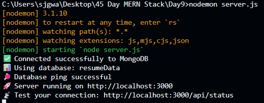
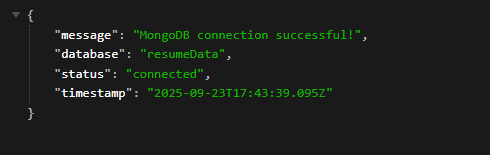

# Day 9 – MongoDB Connection with Express

A **Node.js + Express + MongoDB** application that connects to a local MongoDB instance and provides a `/api/status` endpoint to check the database connection.

---

## 📌 Project Overview
This project demonstrates how to connect an Express.js server to **MongoDB** and verify the connection.  
It listens on **port 3000** and provides:

- `/api/status` → Returns a JSON response with database connection details  

---

## 🎯 Requirements
- [Node.js](https://nodejs.org/) installed  
- [npm](https://www.npmjs.com/) (comes with Node.js)  
- [MongoDB](https://www.mongodb.com/try/download/community) running locally on **port 27017**  

---

## 🚀 Preview

| Feature | Screenshot |
|---------|------------|
| Terminal Output |  |
| `/api/status` JSON Response |  |

---

## 🛠️ Steps to Run

1️⃣ **Install dependencies**
npm init -y
nom i express
npm install express mongodb

node server.sj
